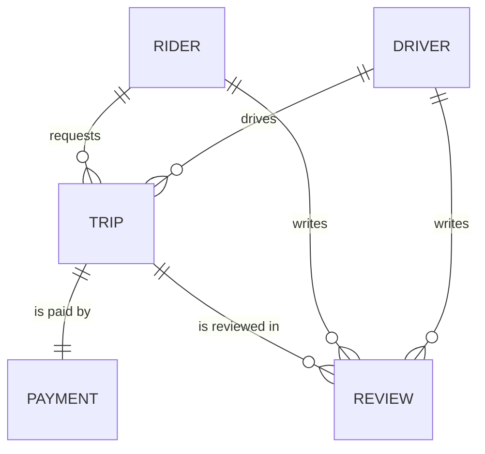
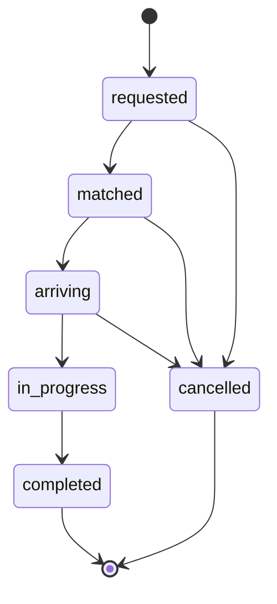

# RideFlow — API Design & Data Model

A ride-hailing product connecting riders who need a trip with nearby
drivers who can give one, from request through payment and review.

## 1. Requirements

**What it does:** A rider requests a trip from a pickup point to a
destination. The system matches them with an available driver. The
driver drives to the pickup, starts the trip, and completes it at the
destination. Payment is captured automatically on completion. Afterward,
both people can rate each other.

**Who uses it:**
- **Riders** — request and pay for trips
- **Drivers** — accept trips, drive them, get paid out

**The five most important actions:**
1. A rider requests a trip (pickup + dropoff)
2. The system matches the trip to an available driver
3. The driver progresses the trip through its lifecycle (accept → arrive → start → complete)
4. Payment is captured automatically when a trip completes
5. Rider and driver each leave a review of the other after a completed trip

Every design decision below traces back to one of these five.

## 2. Entities

### Rider
| Field | Type | Required | Notes |
|---|---|---|---|
| id | string (cuid) | yes | generated, see §3.5 |
| name | string | yes | |
| email | string | yes | unique |
| phone | string | yes | |
| defaultPaymentMethodId | string \| null | no | references a provider-side token, not modeled here |
| createdAt | datetime | yes | |
| updatedAt | datetime | yes | |
| deletedAt | datetime \| null | no | soft-delete, see §3.4 |

### Driver
| Field | Type | Required | Notes |
|---|---|---|---|
| id | string (cuid) | yes | |
| name | string | yes | |
| email | string | yes | unique |
| phone | string | yes | |
| licenseNumber | string | yes | unique |
| vehicleMake | string | yes | |
| vehicleModel | string | yes | |
| vehiclePlate | string | yes | unique |
| status | enum: offline, online, on_trip | yes | default offline |
| rating | decimal(3,2) | yes | denormalized, see §3.1 |
| createdAt | datetime | yes | |
| updatedAt | datetime | yes | |
| deletedAt | datetime \| null | no | |

### Trip
| Field | Type | Required | Notes |
|---|---|---|---|
| id | string (cuid) | yes | |
| riderId | string | yes | FK → Rider |
| driverId | string \| null | no | FK → Driver, null until matched |
| status | enum: requested, matched, arriving, in_progress, completed, cancelled | yes | see §3.3 |
| pickupAddress | string | yes | |
| pickupLat | decimal | yes | |
| pickupLng | decimal | yes | |
| dropoffAddress | string | yes | |
| dropoffLat | decimal | yes | |
| dropoffLng | decimal | yes | |
| fareAmountMinor | integer \| null | no | set on completion, see §3.2 |
| fareCurrency | string(3) | yes | e.g. NGN |
| distanceMeters | integer \| null | no | set on completion |
| durationSeconds | integer \| null | no | set on completion |
| driverNameSnapshot | string \| null | no | denormalized, see §3.1 |
| driverPlateSnapshot | string \| null | no | denormalized, see §3.1 |
| requestedAt | datetime | yes | |
| matchedAt | datetime \| null | no | |
| startedAt | datetime \| null | no | |
| completedAt | datetime \| null | no | |
| cancelledAt | datetime \| null | no | |
| createdAt | datetime | yes | |
| updatedAt | datetime | yes | |

### Payment
| Field | Type | Required | Notes |
|---|---|---|---|
| id | string (cuid) | yes | |
| tripId | string | yes | FK → Trip, unique (one-to-one) |
| riderId | string | yes | FK → Rider |
| amountMinor | integer | yes | see §3.2 |
| currency | string(3) | yes | |
| status | enum: pending, succeeded, failed, refunded | yes | |
| provider | string | yes | e.g. "stripe", "paystack" |
| providerChargeId | string \| null | no | unique when present, see §3.6 |
| createdAt | datetime | yes | |
| updatedAt | datetime | yes | |

### Review
| Field | Type | Required | Notes |
|---|---|---|---|
| id | string (cuid) | yes | |
| tripId | string | yes | FK → Trip |
| authorType | enum: rider, driver | yes | who wrote it |
| authorId | string | yes | |
| targetType | enum: rider, driver | yes | who it's about |
| targetId | string | yes | |
| rating | integer | yes | 1–5 |
| comment | string \| null | no | |
| createdAt | datetime | yes | |

### Relationships & cardinality



- Rider → Trip: one to many (a rider has many trips over time)
- Driver → Trip: one to many, **optional** (a trip has no driver until matched)
- Trip → Payment: one to one (exactly one payment attempt record per trip in this model — a refund is a status change on that same row, not a new row)
- Trip → Review: one to many, **capped at two** (one from the rider, one from the driver) — enforced by `unique(tripId, authorType)`

## 3. The hard questions

### 3.1 Normalization

Two deliberate denormalizations:

1. **`Trip.driverNameSnapshot` / `Trip.driverPlateSnapshot`.** The driver's live name and plate live on `Driver`. But a trip receipt is a historical record — if a driver renames themselves or changes vehicles next month, last month's trip must still show what was true *at the time of that trip*. So the trip captures a snapshot at match time rather than joining to the driver's current row.
2. **`Driver.rating`.** The true source of rating is every `Review` row targeting that driver. But the driver-matching query (Action 2) reads this on essentially every search for a nearby available driver — recomputing an aggregate over potentially thousands of reviews on every read doesn't scale. Instead, `Driver.rating` is a rolling average, updated in the same transaction whenever a new review targeting that driver is inserted.

### 3.2 Money

Every monetary field is a whole number in minor units (kobo, cents) with a currency column beside it: `Trip.fareAmountMinor` + `Trip.fareCurrency`, `Payment.amountMinor` + `Payment.currency`. No decimal money fields anywhere in the schema — decimals introduce floating-point rounding errors that compound at scale.

### 3.3 Status and state machine

**Trip status:**



Allowed transitions: `requested→matched`, `requested→cancelled`, `matched→arriving`, `matched→cancelled`, `arriving→in_progress`, `arriving→cancelled`, `in_progress→completed`.

**Forbidden, explicitly:** `in_progress→cancelled` (once the ride has actually started, it can only be completed — a mid-trip dispute is refunded, not "un-started"), `completed→` anything (a completed trip is immutable), and any transition that skips a step (`requested→in_progress` directly, `matched→completed` directly).

Enforced with a Postgres trigger (`BEFORE UPDATE` on `Trip`) that checks `OLD.status → NEW.status` against an allow-list and raises an exception on any transition not in that list — not just application code, so it holds even against a direct database write or a bug in a future codepath.

### 3.4 Time

Every entity has `createdAt`/`updatedAt`. Soft-delete (`deletedAt`) applies to **Rider** and **Driver** only — `Trip`, `Payment`, and `Review` are never deleted, soft or hard, because they're financial/audit records: a trip that happened has to stay queryable for receipts, tax, and dispute purposes even after the rider who took it closes their account. "Cancelled" is a status on `Trip`, not a deletion. Riders and drivers, by contrast, can close their account — soft-deleting them keeps their historical trips intact (via the FK) while removing them from active matching and search.

### 3.5 Identifiers

All primary keys are generated (cuid), never sequential integers. A sequential `Trip.id` would let anyone enumerate the entire trips table by incrementing a number in a URL — walking every ride ever taken on the platform, including other people's pickup/dropoff addresses. A generated id carries no information about how many rows exist or which one comes "next."

### 3.6 Constraints

| Table | Unique | Foreign keys | Checks |
|---|---|---|---|
| Rider | `email` | — | — |
| Driver | `email`, `licenseNumber`, `vehiclePlate` | — | — |
| Trip | partial unique on `riderId` where `status NOT IN ('completed','cancelled')` | `riderId→Rider`, `driverId→Driver` | `fareAmountMinor >= 0` |
| Payment | `tripId` | `tripId→Trip`, `riderId→Rider` | `amountMinor > 0` |
| Review | `(tripId, authorType)` | `tripId→Trip` | `rating BETWEEN 1 AND 5` |

**Which invalid states become impossible, and what stops each:**
- A rider having two active trips at once → the partial unique index on `Trip.riderId` (only counting non-terminal statuses)
- Two payment rows for one trip → `unique(tripId)` on `Payment`
- A review existing for a trip that isn't completed → a trigger on `Review` insert that checks the referenced trip's status
- A rating outside 1–5 → the `CHECK` constraint on `Review.rating`

### 3.7 Indexes

| Action | Query | Index |
|---|---|---|
| 1. Rider requests a trip | check for an existing active trip | the partial unique index above doubles as this |
| 2. Match to an available driver | find drivers where `status = 'online'` | partial index `Driver(status) WHERE status = 'online'` |
| 3. Driver progresses a trip | find a driver's current trip | `Trip(driverId, status)` |
| 4. Capture payment | look up the payment for a trip | `unique(tripId)` on `Payment` already covers this |
| 5. Leave/read reviews | all reviews about a given driver | `Review(targetType, targetId)` |

(Real geo-matching — "nearest available driver" — needs PostGIS/geospatial indexing, out of scope for this design; noted as a known gap.)

## 4. API design

Base path: `/api/v1`. All mutations that change trip state are separate action endpoints rather than a generic `PATCH status=`, because the state machine has real branching (§3.3) and a single "set any status" field invites clients to attempt illegal transitions the API then has to reject — an explicit endpoint per transition means the URL itself only offers legal moves.

### `POST /api/v1/trips`
Rider requests a trip (Action 1).
**Idempotency:** required `Idempotency-Key` header — replaying the same key returns the original trip rather than creating a second one.

Request:
```json
{
  "riderId": "clx1...",
  "pickupAddress": "14 Aminu Kano Cres, Abuja",
  "pickupLat": 9.0765,
  "pickupLng": 7.3986,
  "dropoffAddress": "Nnamdi Azikiwe Airport",
  "dropoffLat": 9.0065,
  "dropoffLng": 7.2632
}
```
Response `201`:
```json
{ "data": { "id": "clx2...", "status": "requested", "riderId": "clx1...", "requestedAt": "2026-09-28T10:00:00Z" } }
```
Errors: `400` malformed lat/lng, `422` missing required field (names the field), `409` rider already has an active trip (references the partial unique constraint).

### `POST /api/v1/trips/:id/match`
System/internal: assigns an available driver (Action 2). Not idempotent by key — calling it twice on an already-matched trip returns `409`.
Errors: `404` trip not found, `409` trip not in `requested` status, `503` no drivers currently available.

### `POST /api/v1/trips/:id/accept`, `/arrive`, `/start`, `/complete`, `/cancel`
Driver (or rider, for `/cancel`) progresses the trip (Action 3). Each checks the current status against the one legal predecessor in §3.3 and returns `409 INVALID_TRANSITION` naming the current and attempted status if illegal. `/complete` sets `fareAmountMinor`, `distanceMeters`, `durationSeconds`, and triggers payment capture (Action 4) in the same transaction.

Response `200` (example, `/complete`):
```json
{ "data": { "id": "clx2...", "status": "completed", "fareAmountMinor": 250000, "fareCurrency": "NGN", "completedAt": "..." } }
```

### `GET /api/v1/trips/:id`
Errors: `404`.

### `GET /api/v1/riders/:id/trips`, `GET /api/v1/drivers/:id/trips`
List, paginated. `?limit` (default 20, max 100) `&offset` `&status=completed` `&sort=requestedAt&order=desc`.
Response:
```json
{ "data": [ { "...": "..." } ], "meta": { "total": 34, "limit": 20, "offset": 0, "hasMore": true } }
```
Errors: `400` limit over 100 clamped not rejected; negative offset → `400`; unknown `sort` field → `400`.

### `POST /api/v1/trips/:id/reviews`
Action 5. **Idempotency:** `unique(tripId, authorType)` at the database means a second attempt from the same author returns `409` rather than creating a duplicate.
Request: `{ "authorType": "rider", "rating": 5, "comment": "Great driver!" }`
Errors: `422` rating outside 1–5, `409` trip not completed, `409` this author already reviewed this trip.

### `GET /api/v1/drivers/:id/reviews`
List, paginated, same contract as trip lists.

### Basic CRUD
`POST /api/v1/riders`, `GET /api/v1/riders/:id`, `PATCH /api/v1/riders/:id` (name/phone only — email change is a separate verified flow, not modeled here) and the equivalent three for drivers.

### Over-fetching: REST vs GraphQL

Consider a naive `GET /api/v1/trips/:id/full` meant to feed the rider's live trip screen — as REST, it's tempting to just nest everything:
```json
{
  "data": {
    "id": "clx2...", "status": "in_progress", "pickupAddress": "...", "dropoffAddress": "...",
    "fareAmountMinor": null, "createdAt": "...", "updatedAt": "...",
    "rider": { "id": "...", "name": "...", "email": "...", "phone": "...", "createdAt": "..." },
    "driver": { "id": "...", "name": "...", "email": "...", "phone": "...", "licenseNumber": "...", "vehicleMake": "...", "vehicleModel": "...", "vehiclePlate": "...", "rating": 4.8, "createdAt": "..." },
    "payment": null,
    "reviews": []
  }
}
```
The rider's live screen actually needs almost none of that — just:
```graphql
query {
  trip(id: "clx2...") {
    status
    driver { name, vehiclePlate, rating }
    etaSeconds
  }
}
```
**Would I use GraphQL here?** Not for the MVP. One purpose-built endpoint (`GET /api/v1/trips/:id/tracking`, returning only the tracking-relevant fields) solves this specific over-fetch just as well as GraphQL would, with far less operational overhead. I'd switch to GraphQL once there are several genuinely different client types against the same graph — rider app, driver app, an internal ops dashboard, and a partner API — each wanting a different slice, because at that point the number of purpose-built REST endpoints needed starts multiplying with every new client, and a single flexible query layer becomes cheaper than maintaining N of them.

### Real-time: WebSockets vs SSE

The rider watching their driver approach (part of Action 3) needs live position updates with no user-initiated messages going the other way over that same channel — trip actions (cancel, etc.) go through the normal REST endpoints above, not the live channel. That's a one-way, server-to-client stream, which is exactly what **Server-Sent Events** are for: simpler than WebSockets (plain HTTP, automatic reconnection built into the browser's `EventSource`), and I don't pay for bidirectional infrastructure I don't need. WebSockets would be the right call if riders and drivers needed to exchange messages in real time (in-app chat, for instance) — that's genuinely bidirectional and SSE can't do it.